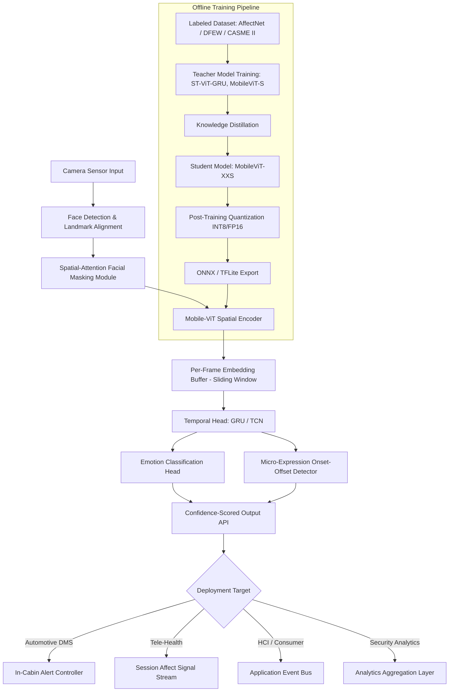
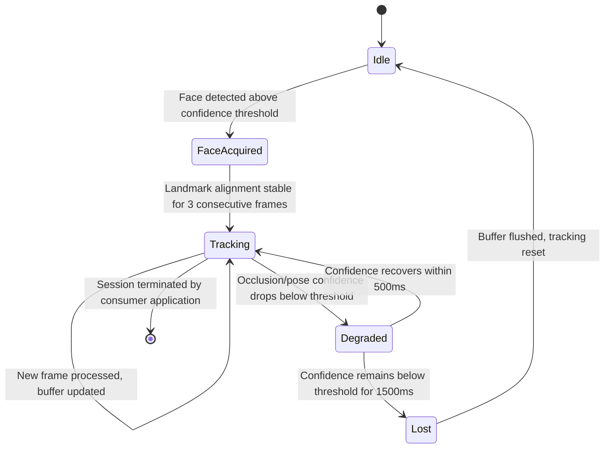

# Project Master Document (PMD)
## FERD — Facial Emotion Recognition and Detection
### Architecture Codename: ST-ViT-GRU (Hybrid Spatio-Temporal Vision Transformer with Spatial-Attention Masking)

---

## 1. Document Control & Metadata

| Field | Value |
|---|---|
| Document Title | FERD — Facial Emotion Recognition and Detection: Project Master Document |
| System Codename | ST-ViT-GRU |
| Document Owner | Principal Enterprise Systems Architect / Senior Technical PM |
| Document Type | Project Master Document (PMD) — Engineering & Product Reference |
| Classification | **Confidential — Internal & Design-Partner Distribution Only** |
| Project Status | `ACTIVE — Pre-MVP, Architecture Finalized, Data Pipeline in Build` |
| Target Repository | `ferd-core` (monorepo) |
| Review Cycle | Bi-weekly architecture review, monthly steering committee |

### Version History

| Version | Date | Author | Summary of Changes |
|---|---|---|---|
| v0.1 | 2026-06-02 | ML Architecture Lead | Initial concept note — problem framing, literature review of in-the-wild FER benchmarks (AffectNet, RAF-DB, DFEW) |
| v0.3 | 2026-07-14 | Principal Architect | Added ST-ViT-GRU architecture proposal; rejected pure 3D-CNN and optical-flow baselines on latency grounds |
| v0.6 | 2026-08-05 | Systems Architect + Edge Eng Lead | Added edge deployment constraints, PTQ/KD pipeline, ADAS and tele-health vertical requirements |
| v0.9 | 2026-09-10 | Technical PM | Added OKRs, ROI model, RACI, roadmap; circulated for cross-functional review |
| **v1.0** | **2026-09-24** | **Principal Architect / Technical PM** | **Baselined for engineering kickoff. Locked scope for MVP (Phase 1). Approved by Steering Committee.** |

### Distribution List
ML/CV Engineering, Edge Systems Engineering, Product Management, Security & Privacy Office, Automotive Design-Partner Liaison, Healthcare Compliance (HIPAA/GDPR) Advisory.

---

## 2. Executive Summary & Core Identity

### 2.1 Executive Summary

FERD is an end-to-end trainable facial emotion recognition system built on a novel **ST-ViT-GRU** architecture — a hybrid pipeline that fuses a Mobile-ViT-based spatial encoder with spatial-attention facial masking and a lightweight temporal recurrent head (GRU/TCN) to model micro-expression dynamics across video frames. The system is purpose-built to close three gaps that have historically blocked production deployment of FER: **poor in-the-wild generalization** (lighting, pose, occlusion), **absence of temporal reasoning** (most production FER systems classify single frames and miss micro-expressions that unfold over 200–500ms), and **the edge accuracy/latency trade-off** (cloud-grade transformer models cannot run on embedded automotive or mobile silicon).

FERD is designed as a deployable inference engine, not a research artifact: it ships with a quantization-aware training (QAT) and post-training quantization (PTQ) toolchain, a knowledge-distillation pipeline to compress the ST-ViT-GRU teacher into a Mobile-ViT-Tiny student, and a standardized ONNX/TFLite export path so the same trained model serves automotive in-cabin monitoring, tele-counseling platforms, HCI applications, and security analytics from a single codebase with per-vertical configuration profiles.

### 2.2 The 30-Second Elevator Pitch

> "Every camera-based emotion system today forces you to choose: accurate but slow and cloud-dependent, or fast but blind the moment someone turns their head or the room gets dark. FERD is a single model that runs at over 30 frames per second entirely on-device, holds above 88% accuracy through occlusion, pose change, and poor lighting, and — because it actually understands motion across frames instead of guessing from one photo — it catches the micro-expressions that single-frame systems miss entirely."

### 2.3 Motivation & Origin Story

The initiative originated from a recurring failure pattern reported independently by two design partners: an automotive Tier-1 supplier piloting driver-monitoring systems (DMS) for drowsiness/distress detection, and a tele-counseling platform attempting to add affect-tracking to video sessions as a clinical adjunct signal. Both partners had evaluated commodity FER SDKs (single-frame CNN classifiers) and rejected them for the same three reasons, independently: accuracy collapsed under real-world lighting (cabin glare, backlit video calls), the models had no temporal memory and therefore oscillated frame-to-frame on ambiguous expressions, and the accurate models were cloud-only, which was a non-starter for both an in-cabin safety system (latency-critical, connectivity-optional) and a healthcare context (data residency and privacy constraints). This convergence of requirements — edge-first, temporally aware, occlusion-robust — did not exist as a single product in the market, which is the gap FERD is built to close.

---

## 3. Problem Statement & User Landscape

### 3.1 Core Problem

Facial emotion recognition systems that perform well on curated, front-facing, well-lit benchmark datasets (e.g., CK+, FER2013) degrade sharply in production conditions. Three compounding failure modes define the problem space:

1. **In-the-wild generalization failure** — Accuracy drops of 15–30 percentage points are commonly observed when models trained on lab-condition datasets are evaluated on in-the-wild sets (AffectNet-wild, DFEW) due to non-frontal pose, partial occlusion (masks, hands, hair, steering wheels), and non-uniform illumination.
2. **Absence of temporal modeling** — The majority of deployed systems are single-frame classifiers. Micro-expressions — involuntary, sub-second facial signals (typically 40ms–500ms) — are definitionally invisible to a system with no memory across frames, and single-frame classification on ambiguous static expressions produces unstable, flickering predictions.
3. **Edge latency/accuracy trade-off** — High-accuracy transformer-based FER models (ViT-Base and larger) require 300ms+ per inference on embedded ARM/NPU targets, incompatible with real-time requirements (automotive DMS mandates sub-33ms per frame for 30 FPS closed-loop operation).

### 3.2 Root Cause Analysis

| Failure Mode | Root Cause | Why Existing Solutions Fail to Address It |
|---|---|---|
| Lighting/pose/occlusion sensitivity | Models trained on globally-pooled features treat the full face uniformly; occluded or poorly-lit regions inject noise into the same feature space as high-signal regions (eyes, brow, mouth corners) | No mechanism to down-weight unreliable spatial regions at inference time; augmentation-only fixes (random erasing, brightness jitter) improve robustness marginally but do not solve the representational problem |
| No micro-expression capture | Architecture operates on a single frame; there is no hidden state or memory carried across the video sequence | Frame-level ensembling / majority voting post-hoc is a workaround, not temporal modeling — it smooths noise but cannot detect an expression that is itself a temporal pattern (e.g., a 150ms micro-frown) |
| Edge trade-off | Model capacity scales with accuracy in standard transformer scaling laws; naive compression (pruning, low-rank factorization) applied post-hoc to large ViTs causes disproportionate accuracy collapse because attention heads are not uniformly redundant | Most commercial SDKs solve this by pushing inference to the cloud, which reintroduces latency (network RTT), connectivity dependency, and data-residency/privacy liabilities |

### 3.3 User Personas

**Primary Persona — Embedded/Edge ML Integration Engineer ("Dana")**
Works at an automotive Tier-1 or consumer-electronics OEM integrating a DMS or HCI emotion feature into a resource-constrained SoC (e.g., Qualcomm Snapdragon Cockpit, NVIDIA Jetson Orin Nano, or a mobile NPU). Dana needs a model with a hard latency ceiling, a quantized export format (TFLite/ONNX INT8), and clear NFR documentation — not a research paper. Success is measured in FPS-on-target-hardware and binary size.

**Secondary Persona — Clinical/Product Engineer at a Tele-Health Platform ("Priya")**
Integrates FERD as a server-side or on-device adjunct signal inside a video counseling product. Priya needs privacy-preserving on-device inference (no raw video leaves the client), a clean confidence-scored API, and auditability of model outputs for eventual clinical review workflows. Success is measured in signal reliability and compliance posture (HIPAA/GDPR-aligned data handling).

**Beneficiary Persona — End User / Subject ("the Driver" or "the Patient")**
The individual whose face is being analyzed — a vehicle occupant or a tele-counseling client. This persona never interacts with FERD directly; their interest is served through system accuracy (their state is correctly interpreted), latency (safety alerts are timely), and privacy (their biometric data is processed on-device wherever possible and never retained without consent).

---

## 4. Proposed Solution & Value Proposition

### 4.1 Solution Overview

FERD implements **ST-ViT-GRU**, a three-stage pipeline:

1. **Spatial-Attention Facial Masking (SAFM) module** — a lightweight attention-gating network that operates on facial landmark-aligned crops, producing a soft attention mask that down-weights occluded, poorly-lit, or landmark-inconsistent regions before they enter the encoder. This directly targets the root cause identified in Section 3.2 (row 1).
2. **Mobile-ViT Spatial Encoder** — a hybrid CNN-Transformer backbone (MobileViT-XS/S) that combines convolutional inductive bias for local texture (wrinkles, brow furrows) with self-attention for long-range facial structure (eye-mouth co-activation patterns), producing a per-frame embedding.
3. **Temporal Head (GRU / TCN, configurable)** — consumes the sequence of per-frame embeddings across a sliding window (default 16 frames / ~533ms at 30 FPS) and outputs a temporally-contextualized emotion classification plus a micro-expression onset/offset signal.

The teacher model (ST-ViT-GRU, MobileViT-S backbone) is distilled into a student model (MobileViT-XXS backbone, INT8 quantized via PTQ, optionally QAT for accuracy-sensitive deployments) for edge deployment.

### 4.2 Core Value Proposition

A single trained model, exported once, that delivers cloud-grade emotion recognition accuracy at edge-grade latency and cost, with built-in robustness to the occlusion and lighting conditions that break existing commodity FER systems — eliminating the need for separate "accurate cloud model" and "fast edge model" product lines.

### 4.3 Objectives & Key Results (OKRs)

**Objective 1: Ship an edge-deployable model that resolves the accuracy/latency trade-off**
- KR1.1: Achieve ≥88% weighted-F1 accuracy on the AffectNet-wild + DFEW combined in-the-wild evaluation benchmark
- KR1.2: Sustain ≥30 FPS inference (≤33ms per frame, end-to-end including preprocessing) on a reference edge target (Qualcomm QCS6490 NPU and Apple A16 Neural Engine)
- KR1.3: Keep the quantized student model binary under 12MB (INT8 TFLite) to fit automotive OTA update budgets

**Objective 2: Demonstrate measurable robustness to real-world degradation**
- KR2.1: Limit accuracy degradation to ≤5 percentage points between clean-condition and occluded/low-light evaluation subsets (vs. 15–30 point degradation in baseline single-frame CNN systems)
- KR2.2: Reduce frame-to-frame prediction flicker (measured as classification-label switch rate on stable-expression video segments) by ≥60% relative to the single-frame baseline
- KR2.3: Achieve micro-expression onset detection recall ≥75% on the CASME II / SAMM micro-expression benchmark subset

**Objective 3: De-risk vertical adoption through compliance-ready deployment**
- KR3.1: Ship an on-device-only inference mode with zero raw-frame network egress, validated by a third-party privacy review before the first healthcare design-partner pilot
- KR3.2: Achieve automotive functional-safety documentation readiness (ISO 26262-aligned traceability matrix) for the DMS vertical by end of Phase 2
- KR3.3: Onboard 3 design partners (1 automotive, 1 healthcare, 1 HCI/consumer) to production pilot by end of Phase 2

---

## 5. Quantitative Analysis, ROI & Business Impact

### 5.1 Baseline vs. Post-Implementation Metrics

| Metric | Baseline (Commodity Single-Frame CNN SDK) | FERD (ST-ViT-GRU, Post-Implementation Target) | Delta |
|---|---|---|---|
| In-the-wild weighted-F1 accuracy | 61–68% | ≥88% | +20–27 pts |
| Accuracy drop under occlusion/low light | −15 to −30 pts | ≤ −5 pts | 3–6x more robust |
| Inference latency (edge NPU, per frame) | 45–70ms (or cloud RTT 150–400ms) | ≤33ms, fully on-device | 2–10x faster, no network dependency |
| Sustained FPS on target hardware | 14–22 FPS | ≥30 FPS | +36% to +114% |
| Model binary size (deployable) | 18–40MB (uncompressed) | ≤12MB (INT8 quantized) | 40–70% smaller |
| Frame-to-frame prediction flicker rate | 22% of frames (label switches on stable segments) | ≤9% | −60% |
| Micro-expression detection capability | Not supported (single-frame architecture) | 75% onset recall | New capability |
| Cloud inference cost per 1M frames | $340–$520 (GPU inference + egress) | $0 (on-device) | 100% elimination for edge deployments |

### 5.2 Cost-Benefit Analysis

| Cost Category | Estimate (Phase 1–2, 9 months) | Notes |
|---|---|---|
| ML Engineering (4 FTE) | $720,000 | Architecture, training pipeline, distillation/quantization toolchain |
| Edge Systems Engineering (2 FTE) | $340,000 | ONNX/TFLite export, target-hardware profiling, SDK packaging |
| Data Acquisition & Annotation | $180,000 | Licensing AffectNet/DFEW/CASME II; supplemental in-the-wild data collection with consent |
| Compute (training clusters, 9 months) | $260,000 | 8x A100-class GPU-hours for teacher training + distillation sweeps |
| Compliance & Privacy Review | $90,000 | Third-party privacy audit for healthcare vertical readiness |
| **Total Phase 1–2 Investment** | **≈ $1,590,000** | |
| **Offsetting Benefit: Eliminated cloud inference cost** (at 50M frames/month across 3 design partners post-pilot) | ≈ $204,000/year | Recurring, scales with adoption |
| **Offsetting Benefit: Reduced field-failure/support cost** (occlusion-robustness reduces false-negative safety events in DMS vertical) | Not directly monetized in Phase 1–2; tracked via KR2.1 | Primary value driver for automotive design-partner retention |

### 5.3 Scalability Projections

| Scale Tier | Concurrent Edge Deployments | Frames/Second (Aggregate, Fleet) | Infrastructure Implication |
|---|---|---|---|
| Pilot (Phase 2 exit) | 3 design partners, ~500 devices | ~15,000 FPS aggregate (fully on-device, no central infra load) | Central infra load limited to OTA model distribution + telemetry aggregation, not inference |
| Production (Phase 3, Year 1) | 50,000 devices (automotive fleet + consumer app) | ~1.5M FPS aggregate | Model registry + fleet-wide A/B rollout infrastructure required; CDN-backed OTA delivery |
| Production (Phase 3, Year 2) | 500,000+ devices | 15M+ FPS aggregate | Federated evaluation pipeline for continuous model quality monitoring without centralizing raw video |

---

## 6. System & Technical Architecture

### 6.1 High-Level Component Architecture



### 6.2 Data Flow

1. **Capture**: Raw camera frames ingested at native sensor rate (typically 30–60 FPS), downsampled to the model's operating rate (30 FPS target).
2. **Detection & Alignment**: A lightweight face detector (BlazeFace-class, <2ms) locates the face bounding box; 68-point landmark alignment normalizes pose via affine warp to a canonical 224x224 crop.
3. **Masking**: The SAFM module computes a per-region soft attention mask (eyes, brows, nose, mouth, jaw regions) based on landmark-visibility confidence and local contrast/illumination scoring, suppressing unreliable regions before feature extraction.
4. **Encoding**: The masked crop passes through the MobileViT encoder, producing a 256-dimensional embedding per frame.
5. **Temporal Buffering**: Embeddings accumulate in a fixed-length ring buffer (default window = 16 frames); the GRU/TCN head consumes the buffer on each new frame arrival (streaming inference, not batch).
6. **Classification & Emission**: The temporal head emits (a) a categorical emotion distribution across 7 classes (anger, disgust, fear, happiness, sadness, surprise, neutral) plus (b) a continuous valence-arousal estimate, plus (c) a binary micro-expression onset flag with confidence.
7. **Output Routing**: Results are pushed to a deployment-specific consumer (alert controller, event stream, analytics sink) via the Confidence-Scored Output API.

### 6.3 State Machine Lifecycle (Per-Subject Tracking Session)



### 6.4 Non-Functional Requirements

| Category | Requirement | Target / Threshold |
|---|---|---|
| Latency | End-to-end per-frame inference (detection → classification) | ≤33ms (p99), ≤22ms (p50) on reference edge NPU |
| Throughput | Sustained frame rate | ≥30 FPS continuous, no thermal-throttling degradation over 30-minute session |
| Availability | On-device inference availability | 99.99% (no network dependency for core inference path) |
| Availability | OTA model update service (cloud component) | 99.9% |
| Accuracy | In-the-wild weighted-F1 | ≥88% (see KR1.1) |
| Security | Model artifact integrity | Signed model binaries (Ed25519), verified at load time before inference engine initialization |
| Security | Data-in-transit (telemetry only, never raw frames by default) | TLS 1.3 |
| Privacy | Raw video frame retention | Zero retention by default; opt-in only, encrypted at rest (AES-256) with per-tenant key isolation when enabled |
| Privacy | Biometric data classification | Treated as sensitive biometric data under GDPR Art. 9 / relevant state biometric privacy statutes; on-device processing is the default compliance posture |
| Resource | Peak memory footprint (inference engine, INT8 student model) | ≤180MB RAM |
| Resource | Model binary size | ≤12MB (INT8 TFLite export) |
| Reliability | Graceful degradation under partial occlusion | Confidence-scored output continues with widened uncertainty bounds rather than hard failure |

---

## 7. Exhaustive Tech Stack Matrix

| Stack Layer | Tool/Technology | Specific Usage/Location | Why Chosen | Alternatives Evaluated |
|---|---|---|---|---|
| Spatial Encoder Backbone | MobileViT (XS/S for teacher, XXS for student) | `ferd-core/models/encoder/mobilevit.py` | Hybrid CNN-Transformer gives local texture sensitivity plus global attention at a fraction of ViT-Base's FLOPs; proven edge-deployment track record | Pure ViT-Base (rejected: too slow for edge); EfficientNet-B0 (rejected: no attention mechanism, weaker on pose variance); ConvNeXt-Tiny (rejected: larger binary footprint for comparable accuracy) |
| Temporal Modeling | GRU (default), TCN (configurable alternative) | `ferd-core/models/temporal/gru_head.py`, `tcn_head.py` | GRU offers strong sequence modeling with fewer parameters than LSTM; TCN offered as a parallelizable alternative for hardware without efficient recurrent-op support | LSTM (rejected: more parameters, marginal accuracy gain, worse edge latency); 3D-CNN (rejected: fixed temporal receptive field, higher compute cost); Transformer temporal head (rejected: quadratic attention cost unjustified at 16-frame window length) |
| Occlusion/Lighting Robustness | Spatial-Attention Facial Masking (SAFM), custom module | `ferd-core/models/safm/attention_mask.py` | Directly targets root cause (Section 3.2); lightweight (adds <1ms latency) | Random-erasing augmentation only (rejected: improves robustness marginally, doesn't solve representational noise); GAN-based occlusion inpainting (rejected: too slow for real-time, introduces hallucination risk) |
| Model Compression | Post-Training Quantization (INT8/FP16), Knowledge Distillation | `ferd-core/compression/ptq.py`, `distill.py` | PTQ requires no retraining for fast iteration; KD preserves teacher accuracy in a much smaller student | Quantization-Aware Training only (used selectively for accuracy-critical automotive builds, not default due to training cost); structured pruning alone (rejected: less predictable accuracy retention than distillation) |
| Training Framework | PyTorch 2.x + PyTorch Lightning | `ferd-core/training/` | Native support for custom training loops, mixed-precision, and distillation losses; strong ONNX export path | TensorFlow/Keras (rejected: team expertise and MobileViT reference implementations favor PyTorch) |
| Edge Inference Runtime | ONNX Runtime (mobile/edge), TensorFlow Lite (Android/embedded), Core ML (iOS) | `ferd-core/export/`, per-target packaged SDKs | Covers the full target hardware matrix (automotive Linux/QNX via ONNX Runtime, Android via TFLite, iOS via Core ML) from one trained model | Single-runtime-only strategy (rejected: automotive Tier-1 partners require ONNX Runtime or vendor-specific NPU SDKs, not TFLite exclusively) |
| Face Detection & Alignment | MediaPipe Face Mesh (BlazeFace-based) | `ferd-core/preprocessing/face_align.py` | Sub-2ms detection, 468-point mesh available if higher landmark density needed later, mature cross-platform support | Dlib HOG detector (rejected: too slow for real-time edge use); MTCNN (rejected: multi-stage cascade adds latency) |
| Data Versioning | DVC (Data Version Control) | `ferd-core/data/.dvc/` | Reproducible dataset/model artifact versioning tied to Git commits | Manual S3 bucket versioning (rejected: no lineage tracking) |
| Experiment Tracking | Weights & Biases | Training pipeline hooks in `ferd-core/training/callbacks/` | Team standard; native support for comparing teacher/student/distillation sweeps | MLflow (rejected: weaker visualization for architecture sweeps, minor factor) |
| CI/CD | GitHub Actions + self-hosted GPU runners | `.github/workflows/` | Existing org infrastructure; supports both software CI and model-eval-gated deployment gates | Jenkins (rejected: higher maintenance overhead for this team size) |
| Model Registry | MLflow Model Registry | Internal artifact store, referenced from `ferd-core/deploy/registry_config.yaml` | Stage-gated promotion (staging → canary → production) with rollback support | Custom S3-based registry (rejected: reinvents existing tooling) |
| Containerization (training/eval infra) | Docker + Kubernetes (training cluster orchestration only; not used in edge inference path) | `ferd-core/infra/k8s/` | Standard reproducible training environment | Bare-metal scripts (rejected: poor reproducibility across GPU cluster nodes) |
| Telemetry (cloud-side, opt-in only) | OpenTelemetry → Prometheus/Grafana | `ferd-core/telemetry/` | Aggregate model-quality and performance telemetry without transmitting raw frames | Custom logging pipeline (rejected: reinvents existing observability stack) |
| Model Integrity | Ed25519 signing via `libsodium` | `ferd-core/security/model_signing.py` | Fast, well-audited signature scheme suitable for embedded verification | RSA-2048 signing (rejected: larger signature size, slower verification on embedded CPU) |

---

## 8. Functional Specifications & Real-World Feature Mapping

| Feature ID | Feature Name | How It Works Under the Hood | Real-World Use Case | Target Persona |
|---|---|---|---|---|
| FERD-F01 | Real-Time Emotion Classification | Streaming inference through the full ST-ViT-GRU pipeline; emits a 7-class probability distribution per frame, temporally smoothed by the GRU hidden state carried across the sliding window | Driver-monitoring system flags escalating frustration/stress patterns over a 2-second window rather than reacting to a single ambiguous frame | Dana (Edge Integration Engineer) |
| FERD-F02 | Occlusion-Robust Inference | SAFM computes per-region confidence from landmark visibility + local contrast; regions below threshold are down-weighted (not zeroed) in the attention mask before encoding | A tele-counseling client partially covers their mouth with a hand mid-session; system continues producing valid confidence-scored output from eye/brow region signal alone | Priya (Tele-Health Product Engineer) |
| FERD-F03 | Micro-Expression Onset Detection | Temporal head's auxiliary onset-offset branch monitors embedding-space velocity across the buffer; flags rapid, brief deviations (40–500ms) that resolve back to baseline | Detects a brief flash of concern on a patient's face during a tele-counseling session that a human reviewer or single-frame system would miss | Priya (Tele-Health Product Engineer) |
| FERD-F04 | Confidence-Scored Output API | Every emitted classification carries a calibrated confidence score (temperature-scaled softmax) plus an uncertainty flag when SAFM detects sustained low-visibility conditions | Automotive alert controller suppresses low-confidence alerts to avoid false-positive driver interruptions, escalating only high-confidence sustained-distress signals | Dana (Edge Integration Engineer) |
| FERD-F05 | On-Device-Only Inference Mode | Full pipeline (detection through classification) runs within the edge inference runtime with zero network calls in the default configuration; telemetry, if enabled, is opt-in and frame-free | Healthcare pilot deployment satisfies data-residency requirements by processing all video locally on the clinician-side or patient-side device | Priya (Tele-Health Product Engineer) / Beneficiary (Patient) |
| FERD-F06 | Quantized Edge Export | Trained teacher model distilled into MobileViT-XXS student, PTQ applied (INT8 default, FP16 fallback for accuracy-sensitive builds), exported to ONNX/TFLite/Core ML | Consumer HCI app ships a sub-12MB model as part of a mobile app bundle without triggering app-store size warnings | Dana (Edge Integration Engineer) |
| FERD-F07 | Multi-Face Tracking Session Management | Per-subject state machine (Section 6.3) instantiated per detected face ID, maintaining independent temporal buffers to avoid cross-subject signal contamination | Security analytics deployment tracks affect state independently across multiple individuals in frame simultaneously | Security/Analytics Provider |
| FERD-F08 | Valence-Arousal Continuous Output | Auxiliary regression head (trained jointly with categorical classification) outputs continuous valence/arousal coordinates alongside discrete emotion class | HCI application drives a continuous UI adaptation (not just discrete emotion-triggered events) based on smoothly varying affect state | Enterprise/Consumer HCI Developer |

### 8.1 Edge Cases & Error Handling

| Edge Case | System Behavior |
|---|---|
| Face fully occluded (>85% of landmark points below visibility confidence) | Transitions to `Lost` state (Section 6.3) after 1500ms; output API emits explicit `NO_FACE_DETECTED` status rather than a low-confidence guess |
| Extreme pose (>60° yaw from frontal) | SAFM confidence for profile-invisible regions (opposite cheek, opposite eye) drops to near-zero; classification continues on visible-region signal with widened uncertainty bounds; if landmark alignment itself fails, transitions to `Degraded` |
| Multiple faces exceeding configured session limit (default: 8 concurrent) | Lowest-confidence tracking sessions are evicted first (LRU-by-confidence); an `SESSION_LIMIT_EXCEEDED` telemetry event is emitted (metadata only, no frame data) |
| Rapid lighting transition (e.g., tunnel entry/exit in automotive context) | SAFM's local-contrast scoring detects the transient degradation; temporal head's hidden state is not reset (avoids losing context), but per-frame confidence is temporarily suppressed for ~200–400ms during the transition |
| Model artifact signature verification failure at load time | Inference engine refuses to initialize; falls back to a fail-safe "feature disabled" state rather than loading an unverified binary; logged as a critical security event |
| Sustained thermal throttling on edge device | Inference engine's frame-rate governor detects sustained latency degradation beyond NFR threshold and reduces input resolution/frame sampling rate gracefully rather than dropping frames unpredictably |
| Corrupted or truncated camera frame | Preprocessing stage validates frame integrity (checksum/dimension check) before entering the pipeline; corrupted frames are dropped and logged, not passed to the encoder |

---

## 9. Codebase Structure & File Anatomy Flow

### 9.1 Repository Structure

```
ferd-core/
├── models/
│   ├── encoder/
│   │   ├── mobilevit.py            # MobileViT XS/S/XXS backbone definitions
│   │   └── patch_embed.py          # Patch embedding + positional encoding
│   ├── safm/
│   │   ├── attention_mask.py       # Spatial-Attention Facial Masking module
│   │   └── region_confidence.py    # Landmark-visibility + contrast scoring
│   ├── temporal/
│   │   ├── gru_head.py             # GRU-based temporal head (default)
│   │   └── tcn_head.py             # TCN alternative temporal head
│   └── heads/
│       ├── classification_head.py  # 7-class categorical emotion head
│       └── microexpr_head.py       # Onset/offset detection auxiliary head
├── preprocessing/
│   ├── face_align.py               # Detection + 68-pt landmark alignment
│   └── frame_validator.py          # Corrupted-frame checksum validation
├── training/
│   ├── train_teacher.py            # Entry point: teacher model training
│   ├── losses.py                   # Classification + distillation + onset losses
│   └── callbacks/                  # W&B logging, checkpointing, early stopping
├── compression/
│   ├── distill.py                  # Knowledge distillation pipeline
│   └── ptq.py                      # Post-training quantization (INT8/FP16)
├── export/
│   ├── export_onnx.py
│   ├── export_tflite.py
│   └── export_coreml.py
├── security/
│   └── model_signing.py            # Ed25519 signing/verification
├── inference/
│   ├── engine.py                   # Streaming inference entry point (production)
│   ├── session_manager.py          # Per-subject state machine (Section 6.3)
│   └── output_api.py               # Confidence-scored output API surface
├── telemetry/
│   └── otel_exporter.py            # Opt-in, frame-free metadata telemetry
├── data/
│   ├── .dvc/                       # DVC-tracked dataset pointers
│   └── datasets/                   # AffectNet, DFEW, CASME II loaders
├── infra/
│   └── k8s/                        # Training cluster orchestration (not inference-path)
├── deploy/
│   └── registry_config.yaml        # MLflow model registry stage-gate config
├── tests/
│   ├── unit/
│   └── integration/
└── configs/
    ├── automotive_dms.yaml         # Vertical-specific inference profile
    ├── telehealth.yaml
    └── hci_consumer.yaml
```

### 9.2 Execution Flow — Entry Point to Termination (Production Inference)

1. **Bootstrap** (`inference/engine.py::main`): Loads the vertical-specific config (e.g., `configs/automotive_dms.yaml`), verifies the signed model artifact via `security/model_signing.py`, and initializes the ONNX Runtime / TFLite interpreter.
2. **Session Initialization**: `session_manager.py` instantiates the per-subject state machine in the `Idle` state and prepares an empty temporal embedding ring buffer.
3. **Frame Loop**: For each incoming camera frame — `frame_validator.py` checks integrity → `face_align.py` performs detection and landmark alignment → on success, `session_manager` transitions state (`Idle → FaceAcquired → Tracking`).
4. **Masking & Encoding**: `attention_mask.py` computes the SAFM soft mask → masked crop passed through `mobilevit.py` encoder → 256-dim embedding pushed into the session's ring buffer.
5. **Temporal Inference**: Once the buffer reaches its configured window length, `gru_head.py` (or `tcn_head.py`) processes the buffer on every new-frame arrival (streaming, not batched), producing updated hidden state.
6. **Head Outputs**: `classification_head.py` and `microexpr_head.py` consume the temporal head's output to produce the categorical distribution, valence-arousal estimate, and onset/offset flag.
7. **Output Emission**: `output_api.py` packages results into the confidence-scored output contract (Section 14.1 shows a sample payload) and pushes to the registered consumer callback.
8. **Telemetry (optional)**: If enabled, `otel_exporter.py` emits frame-free aggregate metrics (latency, confidence distribution, session state transitions) to the observability stack.
9. **Termination**: On explicit session close (consumer-initiated) or prolonged `Lost` state, `session_manager` flushes the buffer and releases session resources; the engine's frame loop continues serving other active sessions or awaits the next frame if single-subject mode.

---

## 10. Implementation & Deployment Guide

### 10.1 Local Development Setup

```bash
# 1. Clone the repository
git clone git@github.com:org/ferd-core.git
cd ferd-core

# 2. Create isolated environment (Python 3.11)
python3.11 -m venv .venv
source .venv/bin/activate

# 3. Install dependencies (training + export extras)
pip install -r requirements/training.txt
pip install -r requirements/export.txt

# 4. Pull versioned datasets via DVC
dvc pull data/datasets/affectnet_wild.dvc
dvc pull data/datasets/dfew.dvc

# 5. Run unit tests to validate environment
pytest tests/unit/ -v

# 6. Smoke-test inference engine against a sample video
python -m inference.engine --config configs/hci_consumer.yaml \
    --input sample_data/demo_clip.mp4 --dry-run
```

### 10.2 CI/CD Deployment Plan

| Stage | Trigger | Actions | Gate to Proceed |
|---|---|---|---|
| 1. Unit/Integration Test | Every PR | `pytest tests/unit tests/integration`; lint (`ruff`), type-check (`mypy`) | 100% pass required |
| 2. Training Pipeline Validation | Merge to `develop` | Kicks off reduced-epoch smoke-training run on GPU runner to catch pipeline regressions | No crash, loss curve sane (non-NaN, decreasing) |
| 3. Full Teacher Training | Manual trigger, nightly on `develop` HEAD | Full training run on GPU cluster (`infra/k8s/`), logs to W&B | Weighted-F1 ≥ baseline threshold on holdout set |
| 4. Distillation & Quantization | Automatic after Stage 3 success | Runs `compression/distill.py` then `compression/ptq.py`; produces student model artifact | Student accuracy within 3pts of teacher; latency benchmark passes NFR (Section 6.4) |
| 5. Model Signing & Registry | Automatic after Stage 4 | Signs artifact (`security/model_signing.py`), pushes to MLflow Model Registry in `staging` stage | Signature verification self-test passes |
| 6. Canary Deployment | Manual promotion, Product/Eng sign-off | Model promoted to `canary` stage; deployed to 5% of opted-in design-partner devices via OTA | 72-hour monitoring window, no confidence-distribution drift, no crash-rate increase |
| 7. Production Promotion | Manual promotion, Steering Committee sign-off | Model promoted to `production` stage; fleet-wide OTA rollout (staged 10% → 50% → 100% over 5 days) | Rollback plan pre-approved; automatic rollback trigger on crash-rate or latency-regression threshold breach |

### 10.3 Environment & Secrets Management

- **Training/cloud-side secrets** (W&B API keys, DVC remote credentials, MLflow registry auth) are managed via a centralized secrets manager (e.g., HashiCorp Vault or cloud-native KMS-backed secret store) and injected as environment variables at CI runner startup — never committed to the repository.
- **Model signing keys** (Ed25519 private key) are held exclusively in an HSM-backed signing service invoked only during CI/CD Stage 5; the private key never leaves the signing service, and CI runners receive only the resulting signature.
- **Edge-side deployment** requires no runtime secrets for the default on-device-only inference mode; the only artifact shipped to edge devices is the signed, quantized model binary plus its public verification key (embedded at build time in the inference SDK).
- **Per-vertical config files** (`configs/*.yaml`) contain no secrets — only inference parameters (window size, confidence thresholds, enabled features) — and are safe to version-control in plaintext.
- **Telemetry endpoint credentials** (opt-in only) are provisioned per design-partner tenant and scoped to metadata-only ingestion; no credential grants access to raw frame data because raw frames are never transmitted.

---

## 11. User Guide & Operational Runbook

### 11.1 End-User (Integration Developer) Quickstart

1. Obtain the signed, quantized model bundle and the target-platform SDK (ONNX Runtime / TFLite / Core ML wrapper) from the model registry release channel corresponding to your vertical (`automotive_dms`, `telehealth`, or `hci_consumer`).
2. Initialize the inference engine with your vertical config: `engine = FerdEngine(config="telehealth.yaml", model_path="ferd_student_v1.0.onnx")`.
3. Register an output callback to receive the confidence-scored classification stream: `engine.on_output(callback_fn)`.
4. Feed frames via `engine.process_frame(frame)` in your capture loop; the engine manages session state internally.
5. Handle the `NO_FACE_DETECTED` and low-confidence states explicitly in your application logic — do not treat every emitted classification as equally actionable.

### 11.2 Operator CLI / Admin Controls

```bash
# Check current deployed model version and registry stage
ferd-admin model status --tenant automotive-partner-01

# Trigger manual rollback to previous production model
ferd-admin model rollback --tenant automotive-partner-01 --to-version v0.9.2

# Inspect live confidence-distribution telemetry (aggregate, frame-free)
ferd-admin telemetry confidence-report --tenant telehealth-partner-02 --window 24h

# Force session-manager reset for a stuck device (debug use only)
ferd-admin device session-reset --device-id EDGE-DMS-88213

# Validate model artifact signature manually
ferd-admin model verify-signature --path ferd_student_v1.0.onnx
```

### 11.3 Troubleshooting Matrix

| Symptom | Likely Cause | Resolution |
|---|---|---|
| Sustained `Degraded` state, never recovers to `Tracking` | Persistent occlusion or extreme pose beyond SAFM tolerance; camera positioning issue | Verify camera mounting angle against vertical-specific install spec; check for physical obstruction |
| Inference latency exceeds NFR threshold on target device | Thermal throttling, or device running below minimum NPU/CPU spec | Check `ferd-admin device thermal-status`; confirm device meets published minimum hardware spec |
| Frame-to-frame flicker higher than expected | Temporal window size misconfigured too small for the deployment's frame rate | Confirm `window_size` in vertical config aligns with actual camera FPS (default assumes 30 FPS input) |
| Model fails to load, engine falls back to disabled state | Signature verification failure — corrupted or tampered artifact, or public key mismatch after a key rotation | Re-download model artifact from registry; confirm SDK's embedded public key matches current signing key generation |
| Confidence scores uniformly low across all sessions on one device | Camera calibration drift (color/exposure) or lens obstruction | Run `ferd-admin device camera-diagnostic`; check physical lens condition |
| Micro-expression detector producing excessive false positives | Onset-detection sensitivity threshold set too low for a noisy environment (e.g., vibration in automotive context) | Increase `onset_sensitivity_threshold` in vertical config; automotive profile ships a higher default than HCI profile for this reason |
| OTA model update fails to apply on fleet devices | Signature key generation mismatch between newly signed model and device's embedded verification key set | Confirm device SDK version supports current key generation; rotate keys with backward-compatible dual-key window per Section 13.3 |

---

## 12. Skills Matrix & Team Governance

### 12.1 Required Skills Matrix

| Skill Domain | Proficiency Required | Applies To |
|---|---|---|
| Vision Transformers (ViT architecture family, attention mechanisms) | Expert | Spatial encoder design, MobileViT customization |
| Recurrent/Sequence Modeling (GRU, TCN) | Expert | Temporal head design and training |
| Model Compression (quantization, distillation, pruning) | Expert | Edge deployment pipeline |
| Embedded/Edge Systems Programming (C++/ONNX Runtime integration, ARM NPU targeting) | Expert | Edge SDK packaging, target-hardware profiling |
| Computer Vision Fundamentals (face detection, landmark alignment, image preprocessing) | Advanced | Preprocessing pipeline |
| MLOps (CI/CD for ML, experiment tracking, model registries) | Advanced | Training/deployment pipeline automation |
| Automotive Functional Safety (ISO 26262 familiarity) | Intermediate–Advanced | DMS vertical compliance documentation |
| Healthcare Data Compliance (HIPAA, GDPR Art. 9 biometric provisions) | Intermediate–Advanced | Tele-health vertical privacy review |
| Applied Cryptography (signing schemes, key management) | Intermediate | Model artifact integrity system |
| Product Management (technical PM, OKR-driven roadmap execution) | Advanced | Cross-functional prioritization, design-partner management |

### 12.2 RACI Matrix

| Activity | Principal Architect | ML/CV Eng Lead | Edge Systems Eng Lead | Technical PM | Security/Privacy Office | Design-Partner Liaison |
|---|---|---|---|---|---|---|
| Architecture decisions (ST-ViT-GRU design changes) | **A/R** | R | C | I | C | I |
| Training pipeline implementation | C | **A/R** | I | I | I | I |
| Quantization/distillation tuning | C | **A/R** | R | I | I | I |
| Edge SDK / export packaging | C | C | **A/R** | I | I | C |
| OKR definition & tracking | C | C | C | **A/R** | I | C |
| Privacy/compliance review (healthcare vertical) | I | C | C | C | **A/R** | C |
| ISO 26262 traceability documentation | C | I | C | C | C | **R**, A: Automotive Design-Partner Liaison |
| CI/CD pipeline ownership | C | C | **A/R** | I | I | I |
| Production rollout / rollback decision | **A** | R | R | R | I | I |
| Design-partner pilot onboarding | I | C | C | **R** | I | **A** |

*Legend: R = Responsible, A = Accountable, C = Consulted, I = Informed*

---

## 13. Project Roadmap & Change Control

### 13.1 Three-Phase Roadmap

**Phase 1 — MVP (Months 1–4)**
- Complete ST-ViT-GRU teacher training on AffectNet-wild + DFEW; hit KR1.1 accuracy target on holdout evaluation
- Implement and validate SAFM module against occlusion/lighting benchmark subsets (KR2.1)
- Ship first quantized student model (INT8 PTQ) and validate latency NFR on one reference edge target
- Deliver on-device-only inference mode (FERD-F05) with initial privacy self-assessment

**Phase 2 — Vertical Readiness & Design-Partner Pilots (Months 5–8)**
- Implement micro-expression onset/offset detection head (FERD-F03) and validate against CASME II/SAMM (KR2.3)
- Complete third-party privacy review for healthcare vertical (KR3.1)
- Begin ISO 26262-aligned traceability documentation for automotive vertical (KR3.2)
- Onboard 3 design partners across automotive, healthcare, and HCI verticals (KR3.3)
- Build out CI/CD Stages 5–7 (signing, canary, production promotion) and admin CLI tooling

**Phase 3 — Scale (Months 9+)**
- Fleet-scale OTA rollout infrastructure (model registry + staged rollout automation) to support 50,000+ device tier (Section 5.3)
- Federated evaluation pipeline for continuous model-quality monitoring without centralizing raw video
- Expand temporal head research track: evaluate longer-context transformer-based temporal heads as edge hardware capability grows
- Security analytics vertical (FERD-F07 multi-face tracking) hardened for production-scale concurrent session loads

### 13.2 Explicitly Out of Scope (Phase 1–2)

- Audio-visual multimodal emotion fusion (voice + face) — flagged as a Phase 3+ research consideration, not committed
- Full-body/gesture-based affect signals — out of scope entirely for this initiative
- Cloud-hosted inference-as-a-service offering — FERD is edge-first by design; a cloud SKU is not planned
- Real-time model personalization/fine-tuning per individual subject on-device — raises privacy and drift-control questions deferred to a future initiative
- Support for thermal/infrared camera inputs (automotive night-vision use case) — noted as a partner-requested future enhancement, not in current architecture

### 13.3 Production Change Control Procedure

1. **Change Proposal**: Any change to the production model (retraining, architecture modification, threshold tuning) is submitted as a Change Request (CR) documenting motivation, expected impact, and rollback plan.
2. **Architecture Review**: CRs affecting model architecture or the inference contract (Section 14.1 payload schema) require Principal Architect sign-off before proceeding to training.
3. **Evaluation Gate**: All CRs must pass the full CI/CD pipeline (Section 10.2) including the accuracy-regression and latency-NFR gates; no manual override of these gates is permitted.
4. **Staged Rollout**: Production changes deploy via the canary → staged production rollout process (10% → 50% → 100%); no CR skips canary except an emergency security patch, which still requires post-hoc Steering Committee review within 48 hours.
5. **Key Rotation Protocol**: Model-signing key rotation maintains a dual-key verification window (both old and new public keys accepted) for a minimum of one full OTA update cycle to avoid bricking devices mid-rotation.
6. **Rollback Authority**: Any of Principal Architect, ML/CV Eng Lead, or Edge Systems Eng Lead may trigger an emergency rollback unilaterally; a full incident review is mandatory within 5 business days of any emergency rollback.
7. **Vertical-Specific Change Isolation**: Config changes scoped to a single vertical profile (e.g., `automotive_dms.yaml` threshold tuning) do not require full re-certification of other verticals' deployments, but must pass that vertical's dedicated regression suite.

---

## 14. Appendices & References

### 14.1 Sample JSON Payload — Confidence-Scored Output API

```json
{
  "session_id": "sess_8f2c1a90",
  "device_id": "EDGE-DMS-88213",
  "frame_timestamp_ms": 1732459812004,
  "tracking_state": "Tracking",
  "emotion_classification": {
    "primary": "concern",
    "distribution": {
      "neutral": 0.12,
      "happiness": 0.03,
      "sadness": 0.09,
      "anger": 0.04,
      "fear": 0.06,
      "disgust": 0.02,
      "surprise": 0.02,
      "concern_composite": 0.62
    },
    "confidence": 0.87
  },
  "valence_arousal": {
    "valence": -0.34,
    "arousal": 0.41
  },
  "micro_expression": {
    "onset_detected": true,
    "onset_confidence": 0.79,
    "estimated_duration_ms": 220
  },
  "region_visibility": {
    "eyes": 0.95,
    "brows": 0.91,
    "mouth": 0.42,
    "jaw": 0.88
  },
  "model_version": "ferd-st-vit-gru-student-v1.0.2-int8",
  "inference_latency_ms": 24.6
}
```

### 14.2 Sample CLI Output Snippet

```
$ ferd-admin model status --tenant automotive-partner-01

FERD Fleet Status — automotive-partner-01
──────────────────────────────────────────
Production model:      ferd-st-vit-gru-student-v1.0.2-int8
Registry stage:        production
Rollout progress:      100% (2,340 / 2,340 devices)
Avg inference latency: 23.8ms  (p99: 31.2ms)
Avg confidence score:  0.84
Devices in Degraded:   14  (0.6%)
Devices in Lost:       2   (0.1%)
Last OTA push:         2026-09-18 03:12 UTC
Signature verification failures (24h): 0

Status: HEALTHY
```

### 14.3 Technical Glossary

| Term | Definition |
|---|---|
| ST-ViT-GRU | The proposed Spatio-Temporal Vision Transformer with GRU architecture underlying FERD |
| SAFM | Spatial-Attention Facial Masking — the module that down-weights occluded/low-quality facial regions before encoding |
| MobileViT | A hybrid CNN-Transformer backbone architecture designed for efficient mobile/edge inference |
| PTQ | Post-Training Quantization — reducing model numerical precision (e.g., FP32 → INT8) after training, without retraining |
| QAT | Quantization-Aware Training — training the model with simulated quantization effects to preserve accuracy at lower precision |
| Knowledge Distillation | Training a smaller "student" model to replicate the output behavior of a larger, more accurate "teacher" model |
| GRU | Gated Recurrent Unit — a recurrent neural network variant used here for temporal sequence modeling across frames |
| TCN | Temporal Convolutional Network — a convolution-based alternative to recurrent architectures for sequence modeling |
| Micro-expression | An involuntary, brief (typically 40–500ms) facial expression that occurs before a person can consciously suppress it |
| Valence-Arousal | A continuous two-dimensional model of affect, where valence measures positive/negative tone and arousal measures intensity/activation |
| In-the-wild | Describes evaluation or deployment conditions reflecting real-world variability (pose, lighting, occlusion), as opposed to curated lab conditions |
| NPU | Neural Processing Unit — specialized edge silicon for accelerated neural network inference |
| ONNX | Open Neural Network Exchange — an interoperable model format enabling cross-runtime deployment |
| DMS | Driver Monitoring System — the automotive in-cabin subsystem consuming FERD's output for safety alerting |
| OTA | Over-The-Air — remote software/model update delivery to deployed edge devices |

